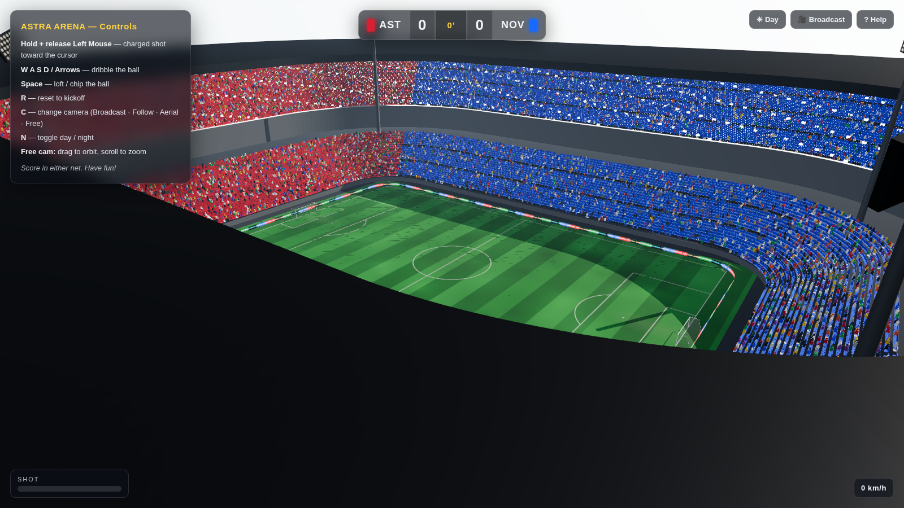
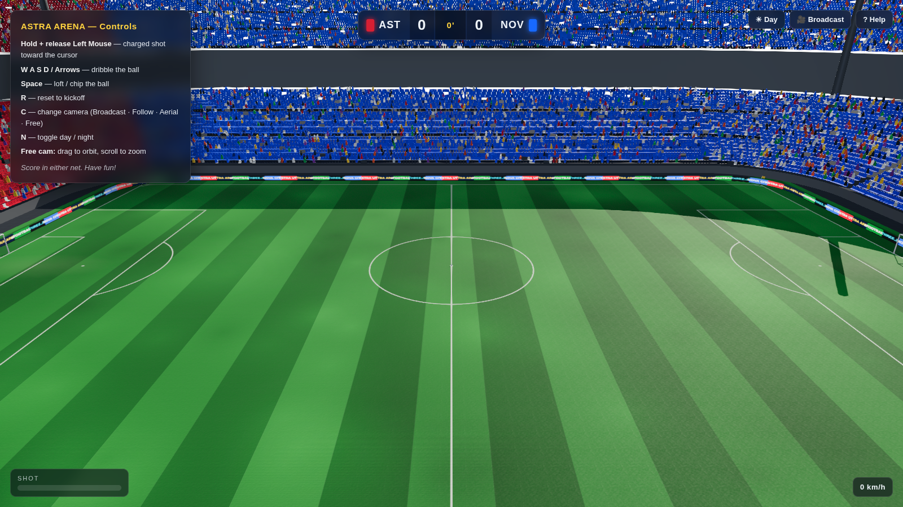
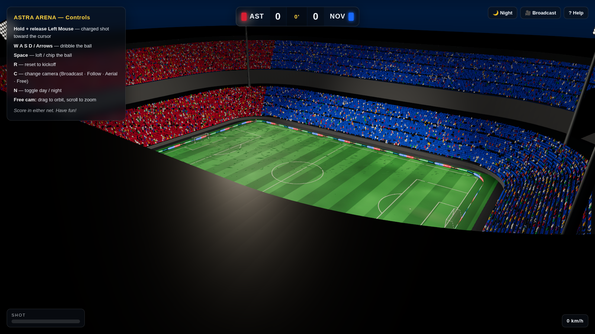

# ⚽ Astra Arena — 3D Football Stadium (JavaScript / Three.js)

A photoreal, **playable** 3D football stadium rendered entirely in the browser
with [Three.js](https://threejs.org/). Regulation pitch, a full two‑tier seating
bowl with a club‑coloured crowd, a cantilever roof, floodlights, animated LED
advertising boards, day/night lighting — and a ball you can actually shoot,
dribble and score with.

It's built to look and feel like a console stadium (the kind you'd see in
*eFootball* / *FIFA*) while being 100% web tech — no Unity, no Blender exports,
every asset generated procedurally in code.



| Broadcast (day) | Floodlit night |
| --- | --- |
|  |  |

---

## ✨ Features

### The pitch (graphics-first)
- **Regulation IFAB markings** drawn to exact metric measurements — centre circle
  (9.15 m), penalty areas (16.5 m), goal areas, penalty arcs & spots, corner arcs.
- **Realistic turf**: procedurally generated mowing stripes, organic colour
  mottling, goalmouth & centre‑circle wear, plus tiled **normal + roughness maps**
  so sunlight and floodlights rake across the grass.
- **Goals** with round posts, crossbars and a slanted, sagging mesh net.

### The stadium
- **Two‑tier seating bowl** built around a rounded‑rectangle perimeter —
  **~57,000 instanced seats** in a single draw call.
- **Crowd mosaics**: club‑coloured sections, banded patterns and a seat‑art
  *tifo* that spells the home club's name across the main stand.
- **Instanced 3D spectators** filling the stands.
- **Cantilever roof** with structural ribs, a hanging fascia and an under‑roof
  **LED light bank**.
- **Four floodlight pylons** with emissive lamp arrays and real spotlights.
- **Animated LED perimeter boards** with scrolling sponsor hoardings.
- Dugouts, corner flags and a concrete apron.

### Rendering ("the engine look")
- PBR materials, **ACES Filmic** tone mapping, sRGB output.
- Real‑time **shadows**, a physical **Sky** + image‑based reflections (PMREM).
- Post‑processing: **UnrealBloom**, **SMAA** anti‑aliasing.
- **Day / Night** mode with a gradient night dome, stars and a floodlit pitch.
- Automatic graceful degradation on software/headless GL.

### The player (rigged & animated)
- A **fully rigged, skinned humanoid** — 19 bones covering pelvis, spine, chest,
  neck, head, both clavicles, upper/lower arms, hands, thighs, shins and feet.
- **Hand‑authored animation clips** — `idle`, `walk` and `run` keyed as real
  locomotion cycles (contact · passing · toe‑off · swing) and played back by an
  `AnimationMixer`. The motion is designed art, not per‑frame procedural code.
- **Speed‑driven blending**: the player eases from idle → walk → run, cross‑fades
  the clips and stride‑syncs playback to ground speed, and turns to face the run.
- Built as a portable **glTF asset** (`src/assets/player.glb`) — the same skin +
  clips you could open in Blender or Unity (see *Baking the player*).

### The goalkeeper (smart AI)
- A keeper for the away side on the same rig (teal kit + gloves) with its own
  **authored clips**: a low **ready stance**, a square **shuffle**, explosive
  **dives** (both sides) and a vertical **jump** — get‑ups come free from the
  mixer blending the clamped dive pose back to the stance.
- **Reads the game**: holds its line and shuffles to stay on the ball→goal
  angle, comes off the line to narrow the angle, **predicts a shot's crossing
  point** and only reacts when it's on target — diving the correct way for
  corners, jumping for high central balls, and **ignoring balls going wide**.
- **Catches** soft shots (then punts upfield), **parries** hard ones, blocks
  shots hit at its body, and in a 1‑v‑1 **smothers** the ball off the dribbler.

### Gameplay
- **Close‑control dribbling**: run near a loose ball to **trap** it, then it
  stays glued just ahead of the boots through turns and sprints. You only lose
  it by **kicking on purpose** (pass / charged shot / cross / aimed shot), by
  taking it **out of play**, or — once opponents exist — by being **tackled**.
- Full arcade **ball physics**: gravity, turf bounce, rolling friction with
  matching spin, aerodynamic drag, reflective walls and **goal‑post collisions**.
- **Goal‑line detection**, live scoreboard with match clock, goal celebration
  and kickoff.
- Four cameras: **Broadcast**, **Follow**, **Aerial** and free **Orbit**.

---

## 🎮 Controls

| Input | Action |
| --- | --- |
| **W A S D / Arrows** | Move the player (camera‑relative) |
| **Shift** | Sprint (run) |
| **Space** | Pass — hold to drive it harder |
| **F** | Cross / lofted ball |
| **Hold + release Left Mouse** | Aimed shot toward the cursor (charged) |
| **R** | Reset to kickoff |
| **C** | Cycle camera (Broadcast · Follow · Aerial · Free) |
| **N** | Toggle day / night |
| **Free cam** | Drag to orbit, scroll to zoom |

---

## 🚀 Running it

Requires [Node.js](https://nodejs.org/) 18+.

```bash
npm install      # install dependencies (three, vite)
npm run dev      # start the dev server
```

Then open the printed URL (defaults to <http://localhost:5173>).

### Production build

```bash
npm run build    # bundle to dist/
npm run preview  # serve the production build
```

> **Tip:** for the full visual experience (bloom + sky reflections) run it in a
> browser with hardware WebGL. On software renderers those effects are skipped
> automatically and the scene falls back to the analytic lights.

---

## 🧱 Project structure

```
src/
├─ main.js                 # bootstrap: renderer, loop, wiring
├─ config.js               # all dimensions, palette & quality knobs
├─ core/
│  ├─ Environment.js       # sky, sun, lights, fog, day/night, IBL
│  └─ PostFX.js            # bloom + SMAA + ACES output chain
├─ stadium/
│  ├─ Stadium.js           # assembles the whole arena (staged loading)
│  ├─ Pitch.js / PitchTexture.js   # turf + line-marking generation
│  ├─ Goals.js             # posts, crossbars, nets
│  ├─ Stands.js / standMath.js     # instanced seating bowl + tifo
│  ├─ Roof.js              # cantilever roof + LED bank
│  ├─ Crowd.js             # instanced spectators
│  ├─ Floodlights.js       # corner pylons + spotlights
│  ├─ AdBoards.js          # scrolling LED hoardings
│  └─ Surroundings.js      # ground, dugouts, corner flags
├─ game/
│  ├─ Ball.js              # ball mesh + classic panel texture
│  ├─ Physics.js           # bounce / roll / drag / collisions / goals
│  ├─ Gameplay.js          # input, player control, scoring, kickoff
│  ├─ CameraRig.js         # broadcast / follow / aerial / orbit
│  ├─ Player.js            # loads player.glb, locomotion + clip blending
│  ├─ Goalkeeper.js        # keeper rig + smart AI (position / dive / save)
│  └─ player/
│     ├─ PlayerRig.js              # skeleton + skinned mesh (kit-configurable)
│     ├─ PlayerAnimations.js       # authored idle / walk / run clips
│     └─ GoalkeeperAnimations.js   # authored stance / shuffle / dive / jump
├─ assets/player.glb       # baked rig + clips (glTF art asset)
├─ ui/HUD.js               # scoreboard, goal banner, loader
└─ utils/                  # geometry + async helpers
```

`tools/screenshot.mjs` captures showcase renders headlessly.

### Baking the player

`src/assets/player.glb` is generated from the rig + clips above and can be
re‑baked at any time:

```bash
npm run dev                 # serve the bake page (in one shell)
npm run bake:player         # export src/assets/player.glb (in another)
```

The exporter writes a standard glTF skin with the `idle` / `walk` / `run`
clips, so the character drops straight into Blender, Unity or any glTF viewer.

---

## 📜 License

MIT — have fun building on it.
